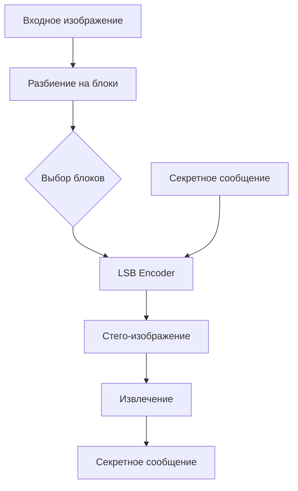

# Цель работы

Изучить основы стеганографии и реализовать алгоритм LSB-встраивания秘密信息 в изображения.

# Задачи

1. Изучить теоретические основы стеганографии
2. Реализовать алгоритм LSB-встраивания
3. Провести эксперименты по оценке качества
4. Сравнить с другими методами

# Теоретические основы

Стеганография — наука о **сокрытии самого факта** наличия информации. В отличие от *криптографии*, которая шифрует сообщение, стеганография скрывает его existence.

Основные требования к стеганографическому алгоритму:

- Незаметность изменений для человеческого глаза
- Устойчивость к сжатию изображений
- Достаточный объем встраиваемой информации

# Результаты экспериментов

<!-- caption: Таб. 1 Результаты сравнения методов -->
| Метод | PSNR (dB) | SSIM | Время (мс) |
|-------|-----------|------|------------|
| LSB   | 42.5      | 0.98 | 15         |
| DCT   | 38.1      | 0.95 | 120        |
| DWT   | 40.3      | 0.97 | 85         |

<!-- caption: Таб. 2 Зависимость PSNR от объема данных -->
| Объем (бит) | PSNR (dB) |
|-------------|-----------|
| 1024        | 48.2      |
| 4096        | 42.5      |
| 16384       | 35.1      |

# Архитектура системы



# Реализация

Основной алгоритм LSB-встраивания:

```python
def lsb_encode(image, message):
    """Встраивание сообщения в LSB пикселей."""
    bits = message_to_bits(message)
    idx = 0
    for pixel in image.pixels():
        if idx < len(bits):
            pixel LSB = bits[idx]
            idx += 1
    return image
```

> Стеганографическая устойчивость определяется способностью алгоритма сохранять встроенную информацию при различных преобразованиях изображения.

# Список источников

1. **Fridrich J.** Steganography in Digital Media. — Cambridge University Press, 2009. – 442 p.
2. **Катс Е.** Стеганография. — ДМК Пресс, 2011. – 256 с.
3. **Petitcolas F.A.P.** Information Hiding — A Survey // Proceedings of the IEEE. — 1999. — Vol. 87, No. 7. — P. 1062–1078.
